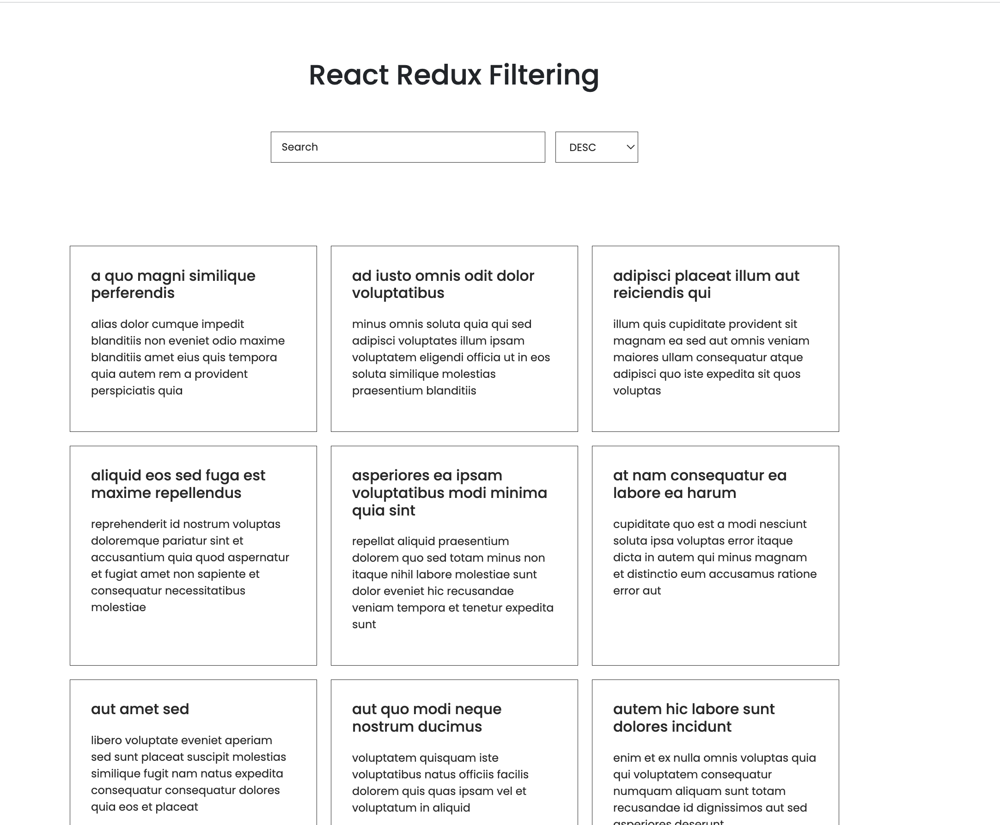
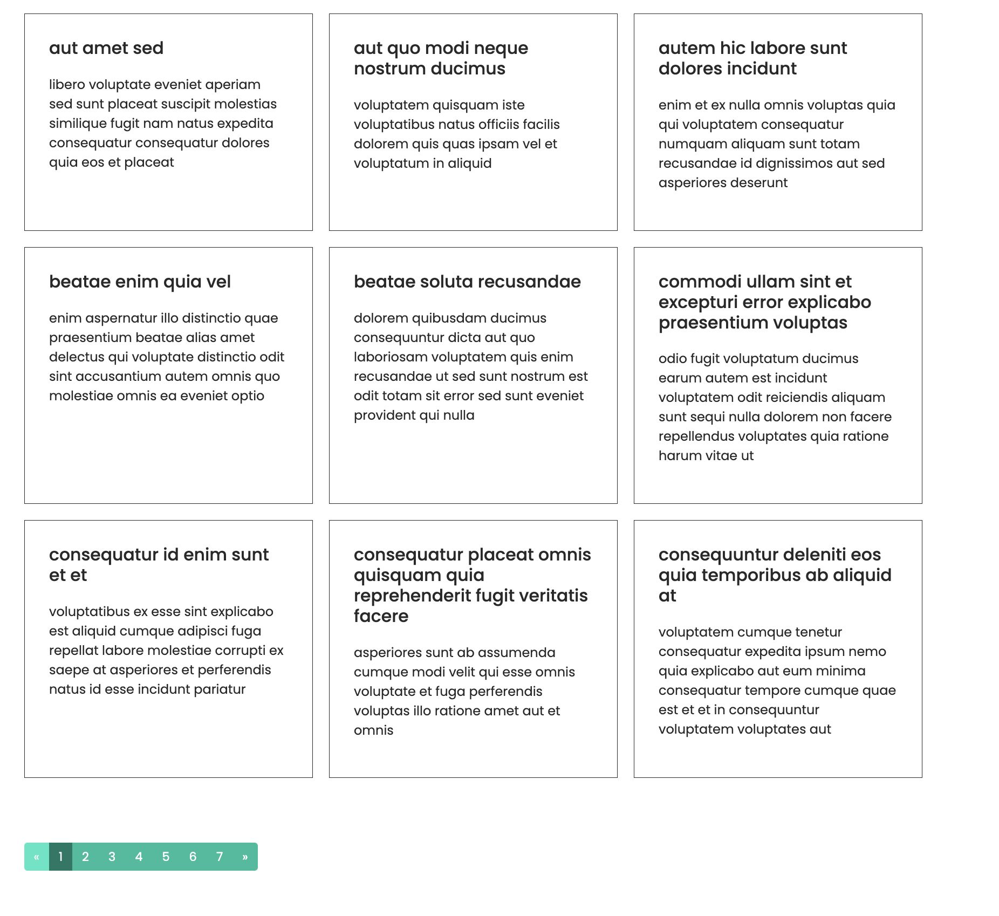
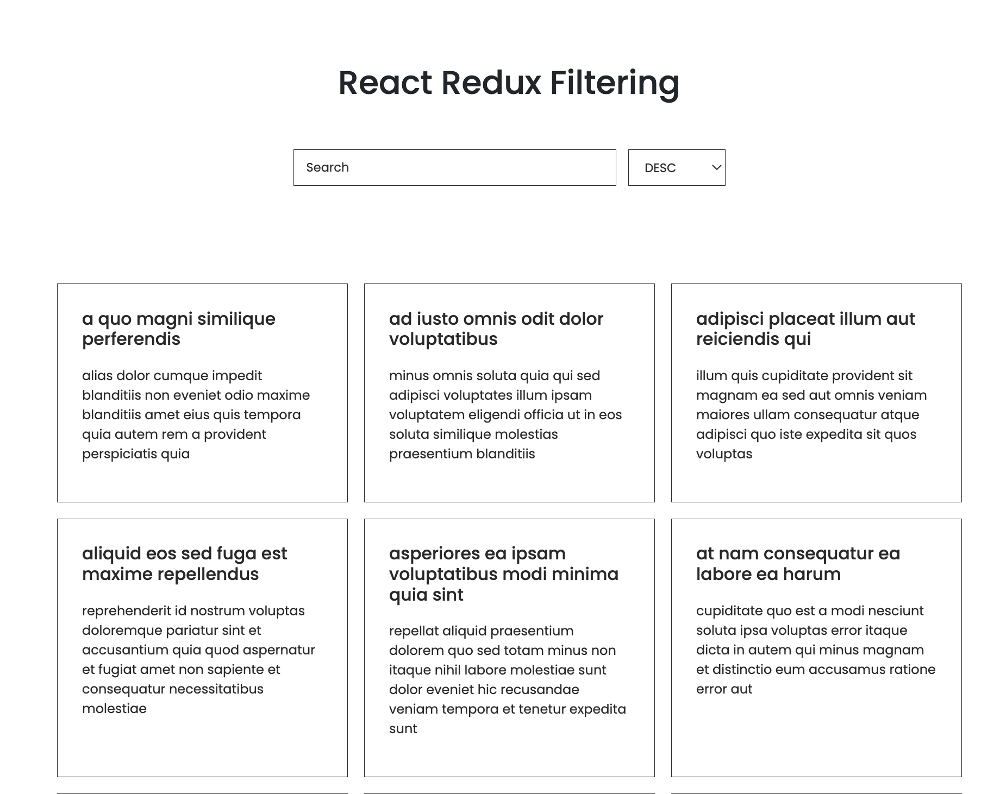

# Getting Started with Create React App

This project was bootstrapped with [Create React App](https://github.com/facebook/create-react-app).

## Available Scripts

In the project directory, you can run:

### `npm start`

node@v10.16.0 or higher
npm@6.9.0 or higher
git@2.17.1 or higher

# Filtering, Sorting and Pagination With React Hooks & Redux

### `Screen shot`
 
 
 
 
